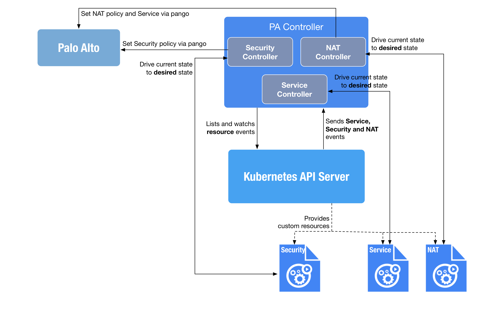

[](https://travis-ci.org/inwinstack/pa-controller) [](https://hub.docker.com/r/inwinstack/pa-controller/) [](https://codecov.io/gh/inwinstack/pa-controller) 
# PA Controller
The PA controller will be sync Kubernetes CRDs to make it easy to set the PA policy.

Once installed, the PA controller provides the following custom resources:

* **NAT**: NAT rules provide address translation, and are different from security policy rules, which allow or deny packets.
* **Security**: Security policy protects network assets from threats and disruptions and aids in optimally allocating network resources for enhancing productivity and efficiency in business processes.
* **Service**: When you define policies for specific applications, you can select one or more services to limit the port numbers the applications can use. 



## Building from Source
Clone repo into your go path under `$GOPATH/src`:
```sh
$ git clone https://github.com/inwinstack/pa-controller.git $GOPATH/src/github.com/inwinstack/pa-controller
$ cd $GOPATH/src/github.com/inwinstack/pa-controller
$ make dep
$ make
```

## Debug out of the cluster
Run the following command to debug:
```sh
$ go run cmd/main.go \
    --kubeconfig $HOME/.kube/config \
    --logtostderr \
    --pa-host=172.22.132.114 \
    --pa-username=admin \
    --pa-password=admin \
    -v=2
```

## Deploy in the cluster
Run the following command to deploy the controller:
```sh
$ kubectl apply -f deploy/
$ kubectl -n kube-system get po -l app=pa-controller
```
